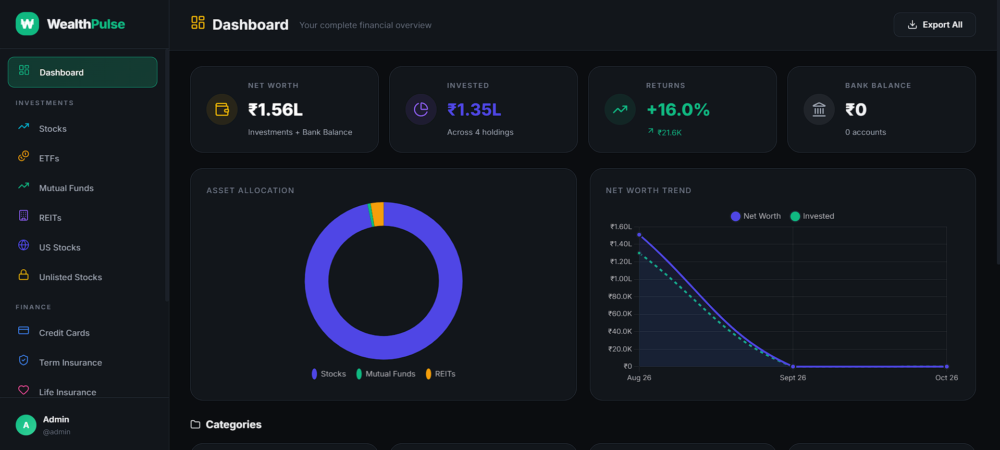
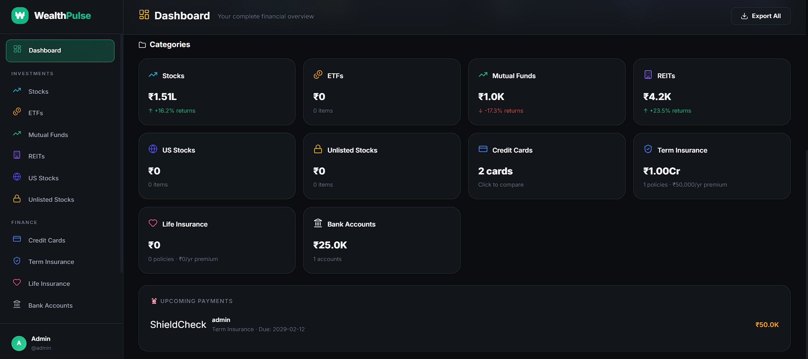
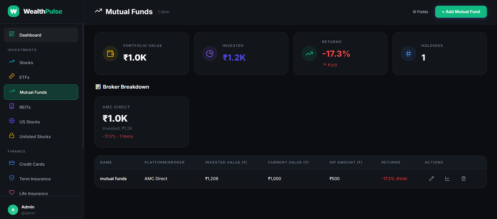
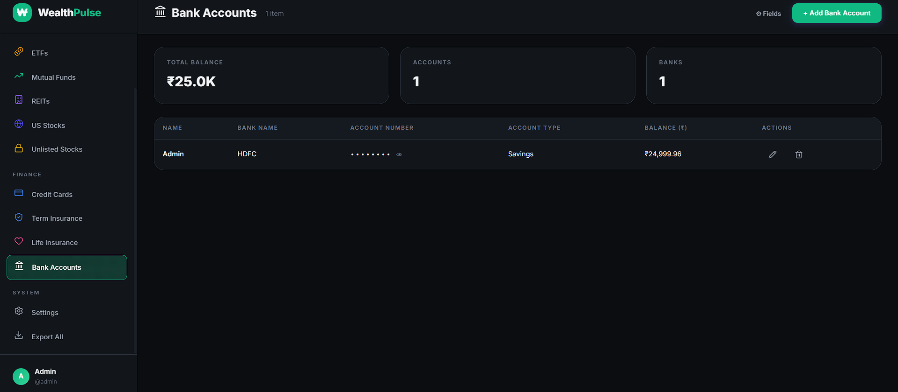
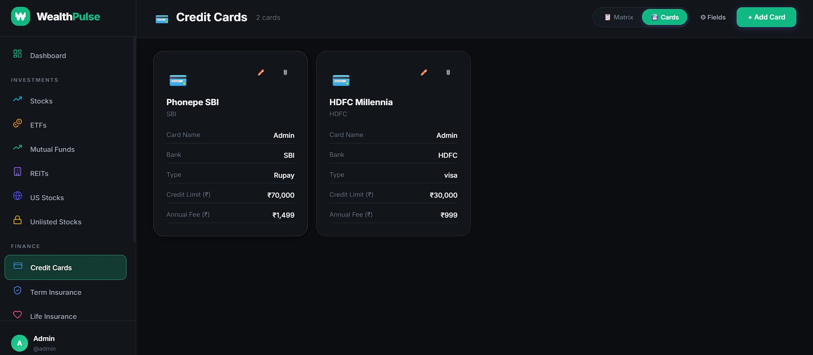
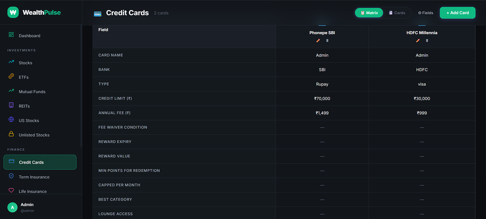
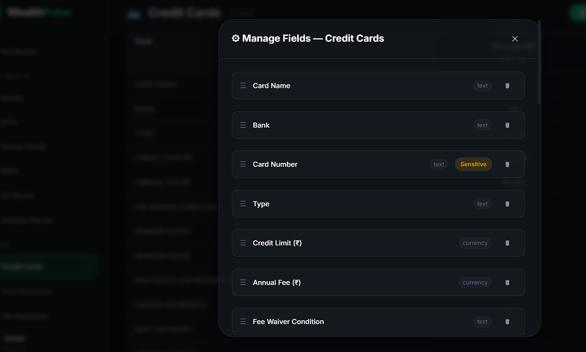
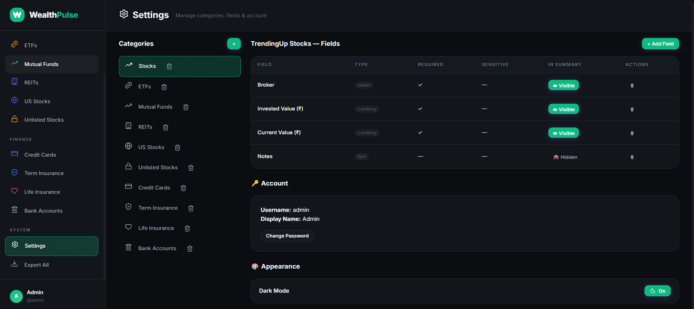

# WealthPulse

WealthPulse is a comprehensive, privacy-first personal finance tracker. It allows you to track all your investments, credit cards, insurance policies, and bank accounts in one centralized, highly customizable dashboard.

> [!WARNING]
> **Prototype Disclaimer:** This application is currently an early prototype under active development. The database schema may experience rapid changes, meaning new updates might break older versions, and backward compatibility is not guaranteed. 
> 
> Please note that **all values must be manually inputted** (there is no automatic data fetching from bank APIs). If you'd like to use this app, please feel free to fork the repository and host it!

## Features

- **Total Customizability:** Define your own asset categories and custom fields for each category.
- **Investment Tracking:** Automatically records monthly snapshots of your portfolio to generate a dynamic "Net Worth Trend" graph.
- **Credit Card Matrix:** Compare annual fees, milestones, and reward values side-by-side in a dedicated grid view.
- **Privacy First:** Data is stored strictly locally in an SQLite database. Your financial data never leaves your machine.
- **Excel Export:** One-click export of all your financial data and monthly trends to a multi-sheet Excel file.
- **Dark & Light UI:** A beautiful, responsive, glassmorphism interface out of the box with dynamic theming.

## Tech Stack

- **Frontend:** React (Vite), Chart.js
- **Backend:** Node.js, Express
- **Database:** SQLite (powered by `sql.js`)

## Documentation

- [Setup Guide](docs/SETUP_GUIDE.md) - Instructions to get the app running on your machine.
- [Project Structure](docs/PROJECT_STRUCTURE.md) - Overview of the codebase for developers.
- [Database Schema](docs/DATABASE_SCHEMA.md) - Deep dive into the Entity-Attribute-Value (EAV) data model used.

## UI Walkthrough

### 1. Dashboard Overview

Get a complete birds-eye view of your investments in one place, featuring a historic net worth trend chart.

### 2. Category Snapshots

View snapshots of all your individual investment categories and keep track of upcoming payments at a glance.

### 3. Mutual Funds & Bank Accounts

Easily add your own mutual fund and bank account details. You have full control to update, track, or delete them as needed.

### 4. Credit Card Matrix

Add and monitor multiple credit cards side-by-side to compare fees, rewards, and milestones.

### 5. Custom Fields

Enjoy absolute freedom to customize the fields you want to track. You can easily reorder, rename, or create entirely new data points.

### 6. App Settings

Toggle between Dark and Light mode, update your credentials, and add or remove categories. Keep your tracker clutter-free by only enabling what you want to see!

## Author

Built and maintained by N Venkata Sai Teja.

For more projects, writings visit [venkatasaiteja.in](https://venkatasaiteja.in) or connect on [LinkedIn](https://www.linkedin.com/in/venkatasaiteja/).
