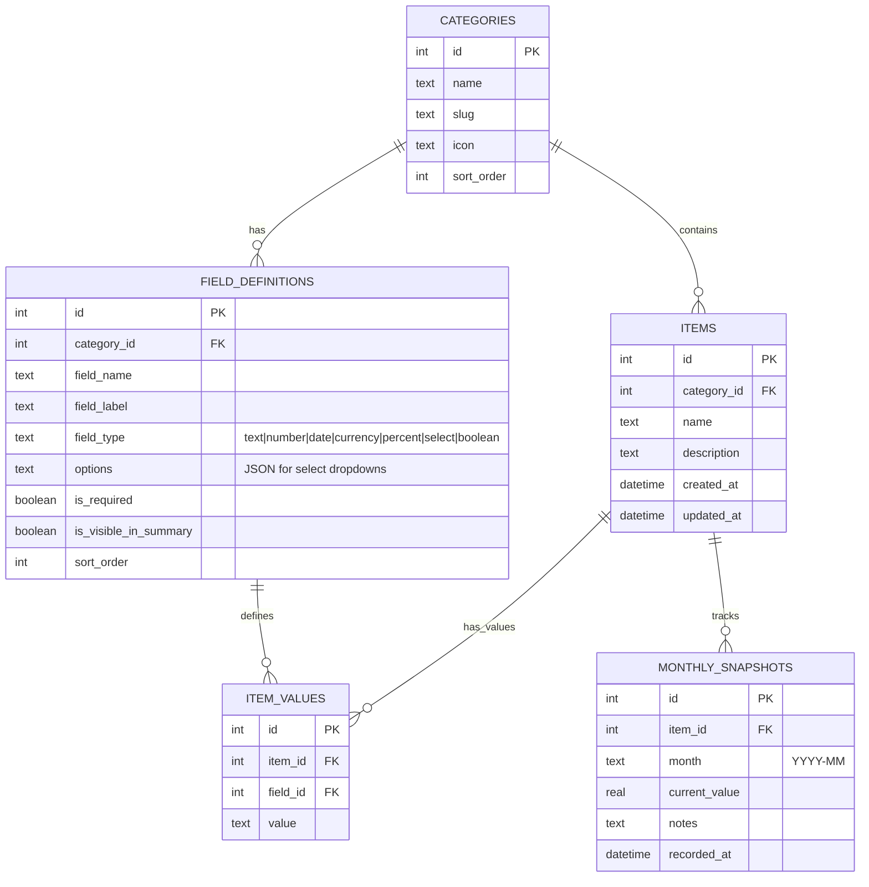

# WealthPulse — Personal Finance & Wealth Tracker

A fully customizable, locally-hosted personal finance web app to track investments, credit cards, insurance, and bank accounts — with dynamic fields, comparison views, trend charts, and Excel export.

---

## Open Questions

> [!IMPORTANT]
> **Please clarify these before I begin coding:**

1. **Security for bank passwords** — Do you want AES-256 encryption with a master password for sensitive data (bank passwords, card numbers), or is basic show/hide toggle sufficient since this runs locally?
2. **Currency** — Should everything be in ₹ (INR), or do you need multi-currency support (e.g., USD for US stocks via INDmoney)?
3. **Monthly value entry** — For stocks/ETFs, will you manually enter current values each month, or would you like auto-fetch from any API (e.g., Google Finance)?
4. **Users** — Is this single-user only, or do you need multi-user/family support?
5. **Credit card milestones** — Can you give an example of what milestone tracking looks like? (e.g., "Spend ₹2L in 90 days → get 5000 reward points"?)

---

## Tech Stack

| Layer | Technology | Rationale |
|-------|-----------|-----------|
| **Frontend** | Vite + React 18 | Fast dev server, component-based UI for complex views |
| **Styling** | Vanilla CSS (custom properties) | Full control, premium dark-mode design |
| **Backend** | Express.js (Node) | Lightweight REST API for CRUD + SQLite access |
| **Database** | SQLite (via `better-sqlite3`) | Local file-based, no setup needed, portable |
| **Charts** | Chart.js | Lightweight, beautiful charts for trends & breakdowns |
| **Excel Export** | `xlsx` (SheetJS) | Multi-sheet Excel export from the backend |
| **Icons** | Lucide React | Clean, consistent icon set |
| **Fonts** | Inter (Google Fonts) | Modern, highly readable typography |

### Why This Stack?
- **Fully local** — No cloud, no accounts. Your data stays on your machine in a `.db` file.
- **SQLite** — Supports dynamic fields via a flexible schema (EAV pattern for custom fields + JSON columns).
- **Single Excel export** — The `xlsx` library can generate multi-sheet workbooks server-side.
- **No heavy frameworks** — No Next.js overhead; Vite + Express is minimal and fast.

---

## Data Model (SQLite Schema)

### Core Tables



### Key Design Decisions

- **EAV (Entity-Attribute-Value) pattern** — `FIELD_DEFINITIONS` + `ITEM_VALUES` allow you to add/remove fields per category without altering the schema. When you add a new field to "Credit Cards", it creates a row in `FIELD_DEFINITIONS`; each card then gets a corresponding `ITEM_VALUES` row.
- **`MONTHLY_SNAPSHOTS`** — Dedicated table for time-series tracking (investment values over months). Powers trend charts.
- **All categories use the same schema** — Stocks, ETFs, Credit Cards, Insurance, Banks are all "categories" with custom fields. This makes the system infinitely extensible.

### Default Categories & Fields

| Category | Default Fields |
|----------|---------------|
| **Stocks** | Company Name, Ticker, Broker (Zerodha/Upstox/etc), Buy Price, Quantity, Buy Date, Current Value, Sector |
| **ETFs (Gold/Other)** | Fund Name, AMC, Units, Buy NAV, Current NAV, Buy Date, Broker |
| **Mutual Funds** | Fund Name, AMC, Folio No, Units, Buy NAV, Current NAV, SIP Amount, Broker |
| **REITs** | REIT Name, Units, Buy Price, Current Price, Dividend Yield, Broker |
| **US Stocks** | Company, Ticker, Platform (INDmoney), Buy Price (USD), Quantity, Current Price (USD), Buy Date |
| **Unlisted Stocks** | Company, Buy Price, Quantity, Current Valuation, Source, Buy Date |
| **Credit Cards** | Card Name, Bank, Card Number (masked), Expiry, Annual Fee, Fee Waiver Condition, Credit Limit, Monthly Limit, Reward Rate, Partner Accelerators, Milestones, Lounge Access, Notes |
| **Term Insurance** | Policy Name, Insurer, Policy No, Sum Assured, Premium Amount, Premium Frequency, Premium Due Date, Policy Start, Policy End, Nominee |
| **Life Insurance** | Policy Name, Insurer, Policy No, Sum Assured, Premium Amount, Maturity Value, Premium Due Date, Policy Start, Maturity Date, Nominee |
| **Bank Accounts** | Bank Name, Account No, IFSC, Branch, Account Type, Balance, Net Banking ID, Net Banking Password (encrypted), UPI ID, Debit Card No, Notes |

---

## Page Designs

### 1. Home / Dashboard

The landing page — a premium dark-themed dashboard with glassmorphism cards showing your complete financial snapshot.

```
┌─────────────────────────────────────────────────────────────────────┐
│  🏠 WealthPulse                    [Export All ⬇]  [⚙ Settings]    │
├─────────────────────────────────────────────────────────────────────┤
│                                                                     │
│  ┌─────────────┐  ┌─────────────┐  ┌─────────────┐  ┌───────────┐ │
│  │ 💰 NET WORTH│  │ 📈 INVESTED │  │ 📊 RETURNS  │  │ 💳 CARDS  │ │
│  │  ₹52.4L     │  │  ₹45.2L     │  │  +15.9%     │  │  5 Active │ │
│  │  ↑ 3.2% MoM │  │             │  │  ₹+7.2L     │  │           │ │
│  └─────────────┘  └─────────────┘  └─────────────┘  └───────────┘ │
│                                                                     │
│  ┌──────────────────────────┐  ┌──────────────────────────────────┐ │
│  │  ASSET ALLOCATION        │  │  NET WORTH TREND (12 months)     │ │
│  │  ┌─────────────────┐     │  │                                  │ │
│  │  │   Donut Chart    │     │  │  ╭──────────────────────╮       │ │
│  │  │  Stocks: 42%     │     │  │  │   Line Chart          │       │ │
│  │  │  MF: 25%         │     │  │  │   with area fill      │       │ │
│  │  │  Gold: 15%       │     │  │  ╰──────────────────────╯       │ │
│  │  │  REITs: 10%      │     │  │                                  │ │
│  │  │  Unlisted: 8%    │     │  │                                  │ │
│  │  └─────────────────┘     │  └──────────────────────────────────┘ │
│  └──────────────────────────┘                                       │
│                                                                     │
│  ┌────────────────────────────────────────────────────────────────┐ │
│  │  CATEGORY CARDS (clickable → navigates to detail page)        │ │
│  │                                                                │ │
│  │  ┌──────────┐ ┌──────────┐ ┌──────────┐ ┌──────────┐         │ │
│  │  │📊 Stocks │ │🪙 Gold   │ │🏢 REITs  │ │🇺🇸 US     │         │ │
│  │  │ ₹18.5L   │ │ ₹6.8L    │ │ ₹4.5L    │ │ $2,100   │         │ │
│  │  │ 12 holds │ │ 3 ETFs   │ │ 2 REITs  │ │ 5 stocks │         │ │
│  │  │ +12.3%   │ │ +18.1%   │ │ +8.4%    │ │ +22.6%   │         │ │
│  │  └──────────┘ └──────────┘ └──────────┘ └──────────┘         │ │
│  │                                                                │ │
│  │  ┌──────────┐ ┌──────────┐ ┌──────────┐ ┌──────────┐         │ │
│  │  │📈 MFs    │ │🔒 Unlstd │ │💳 Cards  │ │🛡 Insrnce│         │ │
│  │  │ ₹11.2L   │ │ ₹3.6L    │ │ 5 cards  │ │ 3 polcy  │         │ │
│  │  │ 8 funds  │ │ 2 stocks │ │ ₹8.5L lmt│ │ ₹2Cr cov │         │ │
│  │  └──────────┘ └──────────┘ └──────────┘ └──────────┘         │ │
│  └────────────────────────────────────────────────────────────────┘ │
│                                                                     │
│  ┌────────────────────────────────────────────────────────────────┐ │
│  │  ⏰ UPCOMING                                                   │ │
│  │  • HDFC Life Premium — ₹24,000 due on 15 Aug 2026             │ │
│  │  • ICICI Card Annual Fee — ₹500 on 22 Aug 2026                │ │
│  │  • SBI Term Insurance — ₹12,500 due on 01 Sep 2026            │ │
│  └────────────────────────────────────────────────────────────────┘ │
│                                                                     │
│  SIDEBAR / NAV                                                      │
│  ├── 🏠 Dashboard                                                   │
│  ├── 📊 Stocks                                                      │
│  ├── 🪙 ETFs                                                        │
│  ├── 📈 Mutual Funds                                                │
│  ├── 🏢 REITs                                                       │
│  ├── 🔒 Unlisted Stocks                                             │
│  ├── 🇺🇸 US Stocks                                                   │
│  ├── 💳 Credit Cards                                                │
│  ├── 🛡️ Insurance                                                    │
│  ├── 🏦 Bank Accounts                                               │
│  ├── ⬇️ Export                                                       │
│  └── ⚙️ Settings (Manage Categories & Fields)                       │
└─────────────────────────────────────────────────────────────────────┘
```

### 2. Investment Detail Page (Stocks / ETFs / MFs / REITs / Unlisted / US Stocks)

Each investment category gets its own page with the same layout structure:

```
┌─────────────────────────────────────────────────────────────────────┐
│  📊 Stocks                              [+ Add Stock] [⬇ Export]   │
├─────────────────────────────────────────────────────────────────────┤
│                                                                     │
│  FILTERS: [All Brokers ▾] [All Sectors ▾] [Search... 🔍]          │
│                                                                     │
│  ┌─────────────────────────────┐  ┌───────────────────────────────┐│
│  │ Portfolio Value  ₹18,52,400 │  │ Monthly Trend (Line Chart)    ││
│  │ Invested        ₹15,20,000 │  │ ╭────────────────────╮        ││
│  │ Returns         +₹3,32,400 │  │ │                    │        ││
│  │ XIRR            +18.4%     │  │ ╰────────────────────╯        ││
│  └─────────────────────────────┘  └───────────────────────────────┘│
│                                                                     │
│  BROKER BREAKDOWN:                                                  │
│  ┌──────────┐  ┌──────────┐  ┌──────────┐                         │
│  │ Zerodha  │  │ Upstox   │  │ Groww    │                         │
│  │ ₹12.3L   │  │ ₹4.1L    │  │ ₹2.1L   │                         │
│  │ 8 stocks │  │ 3 stocks │  │ 1 stock  │                         │
│  └──────────┘  └──────────┘  └──────────┘                         │
│                                                                     │
│  ┌────────────────────────────────────────────────────────────────┐ │
│  │ HOLDINGS TABLE (sortable, editable inline)                    │ │
│  ├──────┬────────┬────────┬─────┬────────┬─────────┬─────────────┤ │
│  │ Name │ Ticker │ Broker │ Qty │Buy Prc │Curr Val │  Returns    │ │
│  ├──────┼────────┼────────┼─────┼────────┼─────────┼─────────────┤ │
│  │ TCS  │ TCS.NS │Zerodha │ 10  │ 3,200  │ 3,850   │ +20.3% ↑   │ │
│  │ INFY │ INFY   │Upstox  │ 25  │ 1,400  │ 1,680   │ +20.0% ↑   │ │
│  │ ...  │        │        │     │        │         │             │ │
│  ├──────┴────────┴────────┴─────┴────────┴─────────┴─────────────┤ │
│  │                    [✏️ Edit] [🗑 Delete] [📊 Add Monthly Value]│ │
│  └────────────────────────────────────────────────────────────────┘ │
│                                                                     │
│  ┌────────────────────────────────────────────────────────────────┐ │
│  │  ⚙ MANAGE FIELDS — [+ Add Field] [Reorder] [Remove]          │ │
│  │  Allows adding custom columns to the table above              │ │
│  └────────────────────────────────────────────────────────────────┘ │
└─────────────────────────────────────────────────────────────────────┘
```

**Monthly Value Entry Modal:**
```
┌──────────────────────────────────────┐
│  📊 Record Monthly Value — TCS      │
│                                      │
│  Month:    [August 2026 ▾]          │
│  Current Price: [₹ 3,850      ]     │
│  Notes:    [Quarterly results good]  │
│                                      │
│  History:                            │
│  Jul 2026: ₹3,720                   │
│  Jun 2026: ₹3,650                   │
│  May 2026: ₹3,500                   │
│                                      │
│          [Cancel]  [Save]            │
└──────────────────────────────────────┘
```

### 3. Credit Cards — Comparison Matrix View

This is the key differentiator — a spreadsheet-like comparison view:

```
┌─────────────────────────────────────────────────────────────────────┐
│  💳 Credit Cards                    [+ Add Card] [⬇ Export]        │
├─────────────────────────────────────────────────────────────────────┤
│  VIEW: [📋 Matrix View ●] [📇 Card View ○]                        │
│                                                                     │
│  COMPARISON MATRIX (rows = fields, columns = cards)                 │
│  ┌─────────────────┬──────────┬──────────┬──────────┬────────────┐ │
│  │  Field           │ HDFC     │ ICICI    │ SBI      │ Axis       │ │
│  │                  │ Regalia  │ Amazon   │ Simply   │ Flipkart   │ │
│  ├─────────────────┼──────────┼──────────┼──────────┼────────────┤ │
│  │ Annual Fee       │ ₹2,500   │ ₹500     │ ₹499     │ ₹500       │ │
│  │ Fee Waiver       │ 5L spend │ 2L spend │ 1L spend │ 2L spend   │ │
│  │ Credit Limit     │ ₹4,00,000│ ₹2,50,000│ ₹1,50,000│ ₹3,00,000 │ │
│  │ Monthly Limit    │ —        │ ₹80,000  │ ₹50,000  │ ₹1,00,000  │ │
│  │ Reward Rate      │ 4 RP/₹150│ 1%/2%    │ 10x      │ 4%/1.5%    │ │
│  │ Partner Rewards  │ SmartBuy │ Amazon 5%│ —        │ Flipkart5% │ │
│  │ Lounge Access    │ 8/yr     │ 4/yr     │ 4/yr     │ 4/yr       │ │
│  │ Milestone 1      │ 3L→Voucher│1L→₹500  │ —        │ 2L→₹500   │ │
│  │ Milestone 2      │ 8L→Flight│3L→₹1500  │ —        │ 3.5L→₹750 │ │
│  │ Expiry           │ 12/2028  │ 06/2029  │ 03/2027  │ 11/2028    │ │
│  │ Card Number      │ ****8842 │ ****3371 │ ****9120 │ ****5567   │ │
│  │ [Custom Field]   │ ...      │ ...      │ ...      │ ...        │ │
│  └─────────────────┴──────────┴──────────┴──────────┴────────────┘ │
│                                                                     │
│  [⚙ Manage Fields] — Add/remove/reorder rows in this matrix        │
└─────────────────────────────────────────────────────────────────────┘
```

**Card Detail View (alternate view):**
```
┌────────────────────────────────────────────────────────────┐
│  ┌──────────────────┐  ┌──────────────────┐               │
│  │  HDFC REGALIA     │  │  ICICI AMAZON    │  ...          │
│  │  ┌────────────┐  │  │  ┌────────────┐  │               │
│  │  │  💳 Card    │  │  │  │  💳 Card    │  │               │
│  │  │  Visual     │  │  │  │  Visual     │  │               │
│  │  └────────────┘  │  │  └────────────┘  │               │
│  │                    │  │                    │               │
│  │  Fee: ₹2,500      │  │  Fee: ₹500        │               │
│  │  Limit: ₹4L       │  │  Limit: ₹2.5L     │               │
│  │  Rewards: 4RP/150 │  │  Rewards: 1%/2%   │               │
│  │                    │  │                    │               │
│  │  [Edit] [Delete]  │  │  [Edit] [Delete]  │               │
│  └──────────────────┘  └──────────────────┘               │
└────────────────────────────────────────────────────────────┘
```

### 4. Insurance Page

```
┌─────────────────────────────────────────────────────────────────────┐
│  🛡️ Insurance                        [+ Add Policy] [⬇ Export]     │
├─────────────────────────────────────────────────────────────────────┤
│  FILTER: [All ▾] [Term ▾] [Life ▾]                                │
│                                                                     │
│  ┌─────────────────────────┐  ┌─────────────────────────┐          │
│  │ Total Coverage          │  │ Annual Premium           │          │
│  │ ₹2,00,00,000            │  │ ₹86,500                 │          │
│  └─────────────────────────┘  └─────────────────────────┘          │
│                                                                     │
│  ┌────────────────────────────────────────────────────────────────┐ │
│  │  POLICIES TABLE                                                │ │
│  ├──────────┬─────────┬──────────┬─────────┬─────────┬───────────┤ │
│  │ Policy   │ Insurer │ Type     │ Sum     │ Premium │ Due Date  │ │
│  ├──────────┼─────────┼──────────┼─────────┼─────────┼───────────┤ │
│  │ HDFC T1  │ HDFC    │ Term     │ ₹1Cr   │ ₹12,500 │ 15 Aug ⚠️ │ │
│  │ LIC Jvn  │ LIC     │ Life     │ ₹50L   │ ₹24,000 │ 01 Sep    │ │
│  │ ICICI T2 │ ICICI   │ Term     │ ₹50L   │ ₹8,000  │ 12 Dec    │ │
│  └──────────┴─────────┴──────────┴─────────┴─────────┴───────────┘ │
│                                                                     │
│  ⏰ PREMIUM CALENDAR (upcoming 6 months visual)                    │
│  ┌────────────────────────────────────────────────────────────────┐ │
│  │  Aug ●    Sep ●    Oct      Nov      Dec ●    Jan             │ │
│  └────────────────────────────────────────────────────────────────┘ │
│                                                                     │
│  [⚙ Manage Fields]                                                 │
└─────────────────────────────────────────────────────────────────────┘
```

### 5. Bank Accounts Page

```
┌─────────────────────────────────────────────────────────────────────┐
│  🏦 Bank Accounts                    [+ Add Account] [⬇ Export]    │
├─────────────────────────────────────────────────────────────────────┤
│                                                                     │
│  ┌────────────────────────────────────────────────────────────────┐ │
│  │  ACCOUNTS TABLE                                                │ │
│  ├──────────┬────────────┬──────────┬─────────┬──────────────────┤ │
│  │ Bank     │ Account No │ Type     │ Balance │ Actions          │ │
│  ├──────────┼────────────┼──────────┼─────────┼──────────────────┤ │
│  │ SBI      │ ****4521   │ Savings  │ ₹2.4L   │ 👁 View Details │ │
│  │ HDFC     │ ****8832   │ Savings  │ ₹1.8L   │ 👁 View Details │ │
│  │ ICICI    │ ****1190   │ Current  │ ₹5.1L   │ 👁 View Details │ │
│  └──────────┴────────────┴──────────┴─────────┴──────────────────┘ │
│                                                                     │
│  DETAIL VIEW (expanded on click):                                   │
│  ┌────────────────────────────────────────────────────────────────┐ │
│  │  🏦 SBI — Savings Account                                     │ │
│  │                                                                │ │
│  │  Account No:      1234 5678 4521      [👁 Show/Hide]          │ │
│  │  IFSC:            SBIN0001234                                  │ │
│  │  Branch:          Hyderabad Main                               │ │
│  │  Net Banking ID:  teja_sbi           [👁 Show/Hide]           │ │
│  │  Password:        ••••••••           [👁 Show/Hide]           │ │
│  │  UPI ID:          teja@oksbi                                   │ │
│  │  Debit Card:      ****7788           [👁 Show/Hide]           │ │
│  │  Notes:           Primary salary account                       │ │
│  │                                                                │ │
│  │  [✏️ Edit]  [🗑 Delete]                                        │ │
│  └────────────────────────────────────────────────────────────────┘ │
│                                                                     │
│  🔒 Sensitive fields are masked by default. Click 👁 to reveal.    │
│  [⚙ Manage Fields]                                                 │
└─────────────────────────────────────────────────────────────────────┘
```

### 6. Settings / Field Management Page

```
┌─────────────────────────────────────────────────────────────────────┐
│  ⚙ Settings — Manage Categories & Fields                           │
├─────────────────────────────────────────────────────────────────────┤
│                                                                     │
│  CATEGORIES:  [Stocks ▾]                                            │
│                                                                     │
│  ┌────────────────────────────────────────────────────────────────┐ │
│  │  FIELDS FOR "STOCKS"                                           │ │
│  │                                                                │ │
│  │  ☰ Company Name    [text]     [Required ✓]  [In Summary ✓]    │ │
│  │  ☰ Ticker          [text]     [Required ✓]  [In Summary ✓]    │ │
│  │  ☰ Broker          [select]   [Required ✓]  [In Summary ✓]    │ │
│  │  ☰ Buy Price       [currency] [Required ✓]  [In Summary ✓]    │ │
│  │  ☰ Quantity        [number]   [Required ✓]  [In Summary ✓]    │ │
│  │  ☰ Buy Date        [date]     [Required ✗]  [In Summary ✗]    │ │
│  │  ☰ Current Value   [currency] [Required ✗]  [In Summary ✓]    │ │
│  │  ☰ Sector          [text]     [Required ✗]  [In Summary ✗]    │ │
│  │                                                                │ │
│  │  [+ Add New Field]                                             │ │
│  │                                                                │ │
│  │  ☰ = drag to reorder, click to edit, 🗑 to delete             │ │
│  └────────────────────────────────────────────────────────────────┘ │
│                                                                     │
│  [+ Add New Category]                                               │
└─────────────────────────────────────────────────────────────────────┘
```

---

## Export Feature

**Single Excel file** with the following sheets:

| Sheet Name | Contents |
|------------|----------|
| Summary | Net worth, asset allocation, key metrics |
| Stocks | All stocks with all fields |
| ETFs | All ETFs with all fields |
| Mutual Funds | All mutual funds |
| REITs | All REITs |
| US Stocks | All US stocks |
| Unlisted Stocks | All unlisted stocks |
| Credit Cards | Comparison matrix (transposed) |
| Insurance | All policies with premium schedule |
| Bank Accounts | All accounts (sensitive data included) |
| Monthly Trends | Historical monthly values for all investments |

---

## Visual Design System

### Color Palette (Dark Theme)
```
Background:     #0a0a0f (deep navy-black)
Surface:        #12121a (card backgrounds)
Surface Hover:  #1a1a2e
Border:         rgba(255, 255, 255, 0.06)
Primary:        #6c5ce7 (vibrant purple)
Primary Glow:   rgba(108, 92, 231, 0.15)
Accent Green:   #00cec9 (teal, for positive returns)
Accent Red:     #ff6b6b (for negative returns)
Accent Gold:    #fdcb6e (for warnings/due dates)
Text Primary:   #e8e8f0
Text Secondary: #8888a0
Text Muted:     #555570
```

### Design Principles
- **Glassmorphism cards** with subtle `backdrop-filter: blur()` and translucent borders
- **Gradient accents** on key metrics (purple → teal)
- **Smooth animations** — card hover lifts, page transitions, number counting animations
- **Responsive** — works on desktop and tablet (primary desktop use)
- **Micro-interactions** — button ripples, toggle slides, toast notifications

---

## Project Structure

```
wealth-tracker/
├── client/                    # Vite React frontend
│   ├── index.html
│   ├── vite.config.js
│   ├── package.json
│   ├── src/
│   │   ├── main.jsx
│   │   ├── App.jsx
│   │   ├── index.css          # Design system & global styles
│   │   ├── pages/
│   │   │   ├── Dashboard.jsx
│   │   │   ├── CategoryPage.jsx       # Generic page for any category
│   │   │   ├── CreditCardsPage.jsx    # Special matrix view
│   │   │   ├── BankAccountsPage.jsx   # Special masked view
│   │   │   ├── InsurancePage.jsx      # Special calendar view
│   │   │   ├── SettingsPage.jsx
│   │   │   └── ExportPage.jsx
│   │   ├── components/
│   │   │   ├── Sidebar.jsx
│   │   │   ├── SummaryCard.jsx
│   │   │   ├── DataTable.jsx
│   │   │   ├── ComparisonMatrix.jsx
│   │   │   ├── ChartArea.jsx
│   │   │   ├── Modal.jsx
│   │   │   ├── FieldManager.jsx
│   │   │   ├── MonthlySnapshot.jsx
│   │   │   └── Toast.jsx
│   │   ├── hooks/
│   │   │   ├── useApi.js
│   │   │   └── useCategories.js
│   │   └── utils/
│   │       ├── formatters.js
│   │       └── constants.js
│   └── public/
│
├── server/                    # Express backend
│   ├── package.json
│   ├── index.js               # Express server entry
│   ├── db.js                  # SQLite setup + migrations
│   ├── seed.js                # Default categories & fields
│   ├── routes/
│   │   ├── categories.js
│   │   ├── fields.js
│   │   ├── items.js
│   │   ├── snapshots.js
│   │   └── export.js
│   └── data/
│       └── wealthpulse.db     # SQLite database file
│
├── package.json               # Root workspace config
└── README.md
```

---

## API Endpoints

| Method | Endpoint | Purpose |
|--------|----------|---------|
| GET | `/api/categories` | List all categories |
| POST | `/api/categories` | Create new category |
| PUT | `/api/categories/:id` | Update category |
| DELETE | `/api/categories/:id` | Delete category |
| GET | `/api/categories/:id/fields` | Get fields for a category |
| POST | `/api/fields` | Add a new field to a category |
| PUT | `/api/fields/:id` | Update field (rename, reorder) |
| DELETE | `/api/fields/:id` | Remove a field |
| GET | `/api/items?category=:id` | Get all items in a category (with values) |
| POST | `/api/items` | Create a new item |
| PUT | `/api/items/:id` | Update item values |
| DELETE | `/api/items/:id` | Delete an item |
| GET | `/api/items/:id/snapshots` | Get monthly snapshots for an item |
| POST | `/api/snapshots` | Record a monthly value |
| GET | `/api/dashboard` | Aggregated dashboard data |
| GET | `/api/export` | Download Excel file (all sheets) |

---

## Proposed Changes

### Server Setup
#### [NEW] `server/package.json` — Dependencies: express, better-sqlite3, cors, xlsx
#### [NEW] `server/index.js` — Express server with API routes
#### [NEW] `server/db.js` — SQLite initialization, migrations, schema
#### [NEW] `server/seed.js` — Default categories and field definitions
#### [NEW] `server/routes/*.js` — RESTful route handlers

---

### Client Setup
#### [NEW] `client/package.json` — Vite + React + Chart.js + Lucide
#### [NEW] `client/vite.config.js` — Dev server with API proxy to Express
#### [NEW] `client/src/index.css` — Complete dark theme design system
#### [NEW] `client/src/App.jsx` — Router + layout with sidebar
#### [NEW] `client/src/pages/*.jsx` — All page components
#### [NEW] `client/src/components/*.jsx` — Reusable UI components

---

### Root
#### [NEW] `package.json` — Workspace scripts (`npm run dev` starts both client + server)

---

## Verification Plan

### Manual Verification
1. Start the app (`npm run dev`) and verify both server and client launch
2. Verify dashboard loads with default categories
3. Add a stock via the Stocks page → verify it appears in the table and dashboard
4. Add monthly values → verify trend chart updates
5. Add a credit card → verify comparison matrix view
6. Add insurance → verify premium due date alerts
7. Add bank account → verify sensitive field masking
8. Add/remove custom fields via Settings → verify tables update
9. Export to Excel → verify all sheets are present with correct data
10. Test responsive layout on different screen sizes
